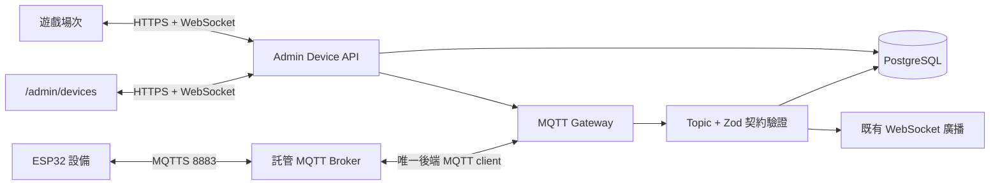

# MQTT 設備管理完整化計畫

> 日期：2026-07-22
> 狀態：**Phase 0-2 + 租約 + 前端綁定已實作並部署（2026-07-23, commit ad9e34cf）**；韌體與實機驗收待硬體端
> 範圍：`/admin/devices`、設備 API、MQTT gateway、ESP32 韌體、遊戲場次綁定、測試與維運

## 1. 結論

現有 `/admin/devices` 已有設備卡片、CRUD、MQTT 狀態、LED、啟停、校準、重啟、統計與日誌 UI，但目前只是「管理介面骨架」，還不能視為可穩定串接硬體。

實作順序必須是：

1. 先凍結 MQTT v1 Topic 與 payload 契約。
2. 補齊場域隔離、設備身分、權限與一次性佈署憑證。
3. 重整 MQTT gateway，加入 TLS、LWT、QoS、驗證、去重與指令 ACK。
4. 再把 `/admin/devices` 改為可完成新增、配對、測試、控制、診斷與綁定遊戲的操作台。
5. 最後以 ESP32 實機、斷線、重送、跨場域與 broker 重啟情境驗收。

不建議直接修補現有 Topic，因為目前後端與 ESP32 範例在 Topic、payload、指令名稱、LED 格式及 session 型別上互不相容。

## 2. 已確認現況與缺口

| 優先度 | 缺口 | 影響 |
| --- | --- | --- |
| P0 | `initializeMqtt()` 只有定義，專案內找不到啟動呼叫 | 生產服務不會主動連 broker，頁面長期顯示未連接 |
| P0 | 後端訂閱 `jiachun/targets/...`，ESP32 發送 `jiachun/devices/...` | hit 與 heartbeat 收不到 |
| P0 | 後端命令送到 `jiachun/commands/{id}`，ESP32 訂閱 `jiachun/devices/{id}/control` | 啟動、停用、LED、校準等命令收不到 |
| P0 | 後端解析 `message.data`，ESP32 發送扁平 JSON | 即使 Topic 對上，內容仍解析失敗 |
| P0 | 新增設備表單沒有硬體 `deviceId` | 新設備無法與 heartbeat、event、command 對應 |
| P0 | `/api/shooting-records` 用內部 UUID 查硬體 ID，且 `apiKey` 不在 schema | 硬體 HTTP fallback 驗證不可依賴 |
| P0 | 設備表沒有 `fieldId`，列表與控制無場域過濾 | 多場域資料與控制權可能交叉 |
| P0 | 部分啟停／場次路由只驗證 Firebase 登入，未走新管理員權限與場域範圍 | 一般登入者可能取得不該有的控制能力 |
| P1 | API 回「命令已發送」只代表 client 存在，未等待 publish callback 或設備 ACK | 操作者無法知道硬體是否真的執行 |
| P1 | heartbeat 只會設為 online，沒有逾時轉 stale/offline | 拔電後可能永久顯示在線 |
| P1 | 收到 event 未做 Zod 驗證、設備驗證、eventId 去重、時間窗檢查 | 壞 payload、重送或偽造事件可能污染分數 |
| P1 | MQTT 連線使用暫時 client ID、`clean: true`，第 10 次重連後停止 | 網路異常後無法自動恢復 |
| P1 | 多處錯誤被靜默吞掉，subscription／publish callback 也未記錄 | 現場故障難以診斷 |
| P1 | 統計後端回 `avgScore`，前端讀 `averageScore`，最高分與分區統計未回傳 | UI 可能顯示空值 |
| P1 | 目前設備測試 26/26 只覆蓋 mock API | 無 broker、協定、斷線、ACL 或實機保證 |
| P2 | ESP32 範例使用已停止維護且只能 publish QoS 0 的 PubSubClient | 命中事件無法取得至少一次傳遞保證 |
| P2 | ESP32 使用 8883，但範例採 `WiFiClient` 且未配置 CA 驗證 | 宣稱 TLS、實際連線方式不完整 |

相關程式：

- `server/mqttService.ts`
- `server/routes/devices.ts`
- `server/storage/device-storage.ts`
- `shared/schema/devices.ts`
- `client/src/pages/admin-devices/`
- `attached_assets/arduino_shooting_target_1764612318480.ino`

## 3. 目標架構



核心原則：

- 瀏覽器不直接連 MQTT broker；所有控制都經管理 API 做權限、場域、驗證與稽核。
- 生產採託管 broker；既有 HiveMQ Cloud 若能提供 per-device auth、Topic ACL、TLS、retain 與稽核即可沿用，否則再評估 EMQX Cloud。開發／CI 用 local Mosquitto，不自架生產 broker。
- Topic 由 server 依 `fieldId + deviceId` 產生，管理員不可自由輸入。
- 每台設備使用獨立憑證與 ACL，可單台撤銷、輪替，不共用全場密碼。
- 關鍵事件採 QoS 1，再由 `eventId` 做冪等去重；不假設 QoS 1 等於「只會一次」。
- 命令採 command ledger + ACK 狀態機，不把「已 publish」當成「已執行」。
- `CLUSTER_WORKERS=0` 維持既有 ADR-0023 單 worker 前提；未來水平擴展前先補跨 worker event bus。

## 4. MQTT v1 契約

### 4.1 Topic

統一格式：`chito/v1/{fieldId}/{deviceId}/{channel}`。

| Channel | 方向 | QoS | Retain | 用途 |
| --- | --- | --- | --- | --- |
| `state` | 設備 → server | 1 | 是 | online/offline/error、韌體、電量、RSSI、uptime；LWT 也寫此 Topic |
| `telemetry` | 設備 → server | 0 | 否 | 高頻、可丟失的感應數值 |
| `event` | 設備 → server | 1 | 否 | hit、trigger、RFID 等不可任意遺失的業務事件 |
| `ack` | 設備 → server | 1 | 否 | 指令 accepted/completed/failed 回執 |
| `command` | server → 設備 | 1 | 否 | 啟停、測試、校準、重啟、場次控制；必須有過期時間 |
| `config` | server → 設備 | 1 | 是 | desired config；設備回報 reported config |

設備 ACL：

- 只可 publish 自己的 `state/telemetry/event/ack`。
- 只可 subscribe 自己的 `command/config`。
- 禁止存取其他設備、其他場域與 server wildcard。
- server principal 才能 subscribe 場域 wildcard、publish 精確設備 Topic。

### 4.2 Payload 共通欄位

所有 payload 至少包含：

- `schemaVersion: 1`
- `messageId`：UUID；event 用於去重，command 同時作 `commandId`
- `deviceId`
- `sentAt`：ISO 8601 UTC
- `bootId`：每次設備開機產生，協助辨識 sequence 重置
- `sequence`：設備單調遞增序號，用於偵測遺漏與重啟
- `type`
- `data`

命令額外包含：

- `issuedAt`
- `expiresAt`
- `requestedBy` 只保留 server 端，不把管理者個資送進設備
- `data` 必須依 allowlist 的 discriminated union 驗證

ACK 額外包含：

- `commandId`
- `status: accepted | completed | failed`
- `completedAt`
- `errorCode` 與安全的 `message`

### 4.3 狀態判定

- `unprovisioned`：已建資料但尚未產生設備憑證。
- `pending`：已佈署、從未成功連線。
- `online`：收到 retained online 或最近 60 秒 heartbeat。
- `stale`：61–90 秒未收到 heartbeat。
- `offline`：超過 90 秒，或收到 broker LWT offline。
- `error`：設備主動回報硬體錯誤。
- `maintenance`：管理員人工停用，不參與遊戲分配。
- `revoked`：憑證撤銷，禁止 broker 連線。

## 5. 資料模型：只新增、不刪欄位

### 5.1 `arduino_devices` 追加

- `field_id`：先 nullable + backfill，再由應用層強制；不得讓新資料為空。
- `protocol_version`
- `capabilities` JSONB，例如 `hitSensor/led/buzzer/battery/ota`。
- `provision_status`
- `broker_principal`
- `credential_version`
- `credential_rotated_at`
- `desired_config` JSONB
- `reported_config` JSONB
- `revoked_at`

沿用現有 `id` 作資料庫 UUID、`device_id` 作不可變硬體 ID。現有 `mqtt_topic` 保留做相容與遷移，不再讓 UI 手填。

### 5.2 新增 `device_commands`

記錄 `commandId`、場域、設備、命令、payload、狀態、要求者、publish/ACK/完成/過期時間與錯誤，作為 UI 真實進度、稽核及重試依據。

### 5.3 擴充 `device_logs` 或新增 `device_events`

至少要有 `fieldId`、`eventId` unique、Topic、schemaVersion、severity、原始 payload、接收時間與處理結果。hit 寫分前先以 `eventId` 去重。

### 5.4 新增 `device_session_bindings`

記錄設備目前綁定的 game/session/page、lease 狀態與釋放時間，避免同一台靶機被兩場遊戲同時啟用。

### 5.5 憑證原則

- 不把 MQTT 密碼、Wi-Fi 密碼或私鑰明文存進 Git、log 或一般資料表。
- 管理頁只在 provisioning 建立當下顯示一次 secret。
- DB 只存 broker credential reference；若採 broker HTTP/PostgreSQL auth，則存 salted hash。
- 支援單台撤銷與輪替，舊憑證在確認新憑證上線後失效。

## 6. 後端模組拆分

把 573 行 `mqttService.ts` 拆成小模組，維持檔案 ≤ 800 行、函式 ≤ 50 行：

```text
server/mqtt/
├── mqtt-client.ts          # 連線、TLS、重連、subscribe lifecycle
├── topic.ts                # Topic builder/parser，拒絕非 v1 Topic
├── contracts.ts            # Zod payload/command schemas
├── ingest.ts               # state/telemetry/event/ack 分流
├── command-service.ts      # ledger、publish、timeout、ACK 狀態機
├── presence-service.ts     # heartbeat/LWT/stale/offline
├── provisioning.ts         # broker principal/ACL/輪替 adapter
└── metrics.ts              # broker、lag、錯誤、吞吐指標
```

啟動流程：

1. server boot 讀取並驗證 `MQTT_ENABLED`、`MQTT_BROKER_URL`、憑證與 CA。
2. 只有單 worker 啟動 gateway；連線失敗不讓 HTTP crash，但 health 顯示 degraded。
3. 使用固定 server client ID、持久 session、指數退避 + jitter，不設定永久停止重連次數。
4. subscribe 必須確認 callback 結果；錯誤進 Sentry／結構化 log。
5. 收訊先解析 Topic、查已註冊且同場域設備、Zod 驗證 payload、驗證時間窗與 eventId。
6. 寫 DB 成功後才對遊戲與管理頁送 WebSocket 更新。
7. shutdown 時 graceful unsubscribe/end；broker 非預期斷線由 LWT/health 呈現。

## 7. 管理 API 與權限

統一使用 `requireAdminAuth`、`requirePermission`、`req.admin.fieldId`，逐步把舊 `/api/devices` 相容層導向新 service。

建議權限：

- `device:view`
- `device:provision`
- `device:control`
- `device:configure`
- `device:firmware`
- `device:delete`

建議 API：

- `GET /api/admin/devices`
- `POST /api/admin/devices`
- `PATCH /api/admin/devices/:id`
- `POST /api/admin/devices/:id/provision`
- `POST /api/admin/devices/:id/credentials/rotate`
- `POST /api/admin/devices/:id/commands`
- `GET /api/admin/device-commands/:commandId`
- `GET /api/admin/devices/:id/events`
- `GET /api/admin/devices/:id/statistics`
- `POST /api/admin/devices/:id/bind-session`
- `POST /api/admin/devices/:id/unbind-session`
- `GET /api/admin/mqtt/health`

安全要求：

- 每一筆 read/write 都帶 field scope；super admin 跨場域也使用目前切換後的 field。
- command 只能使用 Zod allowlist，刪除現有任意字串 fallback。
- reboot、韌體更新、全體廣播需二次確認、較高權限、rate limit 與 audit log。
- 廣播必須限定目前場域，不存在全平台 `jiachun/commands/broadcast`。
- 所有錯誤回繁中安全訊息，內部細節寫結構化 log，不回 broker 憑證或完整 payload。

## 8. `/admin/devices` 完整功能

### 8.1 頁首與總覽

- Broker 狀態：connected/degraded/disconnected、最後連線、重連次數、最後收訊時間。
- 卡片：在線、離線、異常、待佈署、低電量、韌體待升級。
- 搜尋與篩選：狀態、設備類型、位置、韌體、目前場次。
- 列表每 10 秒 polling 作 fallback；正常以既有 WebSocket 收 presence/ACK 更新。

### 8.2 新增設備精靈

1. 基本資料：名稱、類型、硬體 ID、位置、capabilities。
2. server 自動產生 Topic、client ID、per-device credential 與 ACL。
3. 一次性下載 provisioning JSON／QR，不在後續 API 回 secret。
4. 等待首次連線，畫面即時顯示 TLS、auth、subscribe、heartbeat 檢查。
5. 執行燈號、感應器、蜂鳴器與 RTT 測試。
6. 測試全綠才標記 ready，才能綁遊戲。

### 8.3 設備詳情

Tabs：

- 概況：連線、last seen、RSSI、電量、韌體、uptime、目前場次與能力。
- 測試／控制：只顯示該設備 capabilities 支援的控制。
- 指令：queued → published → accepted → completed/failed/expired 時間軸。
- 事件：分頁、類型／嚴重度／時間篩選、eventId 與 correlationId。
- 設定：desired vs reported 差異、套用結果與回滾值。
- 韌體：目前版本、目標版本、升級批次與結果；首版只規劃，不急著開 OTA。

### 8.4 操作安全

- offline、revoked、maintenance 或 broker disconnected 時禁用控制並說明原因。
- reboot、刪除、rotate credential、broadcast 必須 AlertDialog；刪除改軟停用優先。
- 顯示「命令等待設備確認」，收到 completed ACK 才顯示成功。
- 修正 stats contract；非射擊設備不顯示射擊統計。

## 9. ESP32 韌體方案

建議從 PubSubClient 遷移到 Espressif 官方 ESP-MQTT／ESP-IDF 元件，理由是現有 PubSubClient 已宣布停止維護、publish 只有 QoS 0，而 ESP-MQTT 有 MQTT 5 over TLS 官方範例。

韌體必做：

- 使用 `WiFiClientSecure` 等價能力或 ESP-MQTT TLS transport，驗證 broker CA 與 hostname。
- 固定 client ID，不把 secret 放進 client ID 或 Serial log。
- 設定 retained LWT offline；連線成功發 retained online state。
- event/ack 本地 queue，斷線後按 eventId 重送；server 端冪等。
- 指數退避 + jitter，不使用失敗後無限重啟的 blocking loop。
- 驗證 command schemaVersion、deviceId、expiresAt、command allowlist。
- 先回 accepted，執行完再回 completed/failed；相同 commandId 不重複執行。
- provisioning 資料存 NVS；支援安全清除與憑證輪替。
- Wi-Fi 密碼、MQTT secret 不硬編碼於 repo；首版可 USB serial provisioning，第二版再做 captive portal。
- 韌體內 score 不用 random；由感應器校準規則產出 raw zone，由 server 套遊戲計分規則。

## 10. 遊戲串聯

- Admin 編輯 shooting page 時，DeviceSelect 只列目前場域、ready、capability 符合的設備。
- 啟動場次時建立 device lease，server 發 `start_session` command；ACK completed 才讓玩家進入可射擊狀態。
- event 的 sessionId 不直接信任設備；以 server 現行 binding 為準，設備只送 eventId/zone/raw value。
- 結束、逾時、管理員救援或 server restart 都要釋放 lease 並送安全停用命令。
- 同一設備同時間只允許一個 active binding；衝突回 409 並顯示目前佔用場次。
- 命中事件持久化成功後才廣播 `shooting_hit`，並保留 eventId 供爭議追查。

## 11. 分階段推進

| Phase | 工作 | 交付物 | 預估 |
| --- | --- | --- | --- |
| 0 協定凍結 | ADR、Topic builder、Zod contract、硬體 simulator、local Mosquitto | 不依賴實機可重現端到端訊息 | 0.5–1 天 |
| 1 安全地基 | additive migration、field scope、RBAC、provisioning、舊 ID 修正 | 新設備可安全註冊且跨場域隔離 | 1.5–2 天 |
| 2 Gateway | boot wiring、TLS、重連、LWT、presence、ingest、command ledger/ACK | broker ↔ server 穩定且可診斷 | 2 天 |
| 3 Admin UI | onboarding wizard、即時狀態、控制回執、事件／指令／設定 tabs | `/admin/devices` 完整可用 | 2 天 |
| 4 韌體 | ESP-MQTT、TLS、v1 contract、queue、ACK、provisioning | 第一台 ESP32 通過實機測試 | 2–3 天 |
| 5 遊戲綁定 | DeviceSelect、lease、session lifecycle、server-authoritative scoring | 射擊任務可安全接真實設備 | 1.5–2 天 |
| 6 驗收維運 | integration/e2e/HIL/chaos、runbook、監控、回滾 | 可進 pilot 的 release candidate | 1–1.5 天 |

總估時：11–14 個工作天；若 broker 沒有可自動化的 credential/ACL API，需另加 1–2 天做 provider adapter 或人工 provisioning runbook。

## 12. 測試與驗收標準

### 自動測試

- Topic builder/parser、所有 Zod payload 與 command state machine 單元測試。
- API CRUD、RBAC、跨場域隔離、任意 command 拒絕、危險操作稽核。
- local Mosquitto integration：TLS 測試環境、訂閱、publish、LWT、retain、重連。
- 重複 QoS 1 event 只建立一筆業務紀錄。
- 過期 command 不執行；重複 commandId 不重複執行。
- Admin React Testing Library + Playwright onboarding/control/diagnostics 流程。
- 覆蓋率維持 > 80%，並補真 broker 測試，不以全 mock 取代。

### 實機與故障測試

- 第一台設備從 provisioning 到 online ≤ 60 秒。
- 正常網路 command completed ACK p95 ≤ 2 秒。
- 1,000 筆模擬 hit 在重送情境下 DB 恰好 1,000 筆，無重複計分。
- 拔電由 LWT 快速離線；網路靜默最遲 90 秒顯示 offline。
- Wi-Fi 斷線 5 分鐘、broker 重啟、server 重啟後都能自動恢復。
- 舊憑證輪替後不能連線；新憑證正常。
- A 場域管理員看不到也控制不到 B 場域設備。
- 同一設備被兩個 session 競爭時，第二個明確 409，不會雙重計分。
- 實機 hit → DB → WebSocket → 玩家／Admin UI 全鏈路可追查同一 eventId。

## 13. 上線策略與回滾

1. 僅在隔離 dev DB／本地 Docker DB 做 additive migration，不連生產 DB 開發。
2. 以 feature flag `MQTT_V1_ENABLED=false` 合併；舊流程暫時保留讀取相容。
3. simulator 全綠後接一台測試設備，不先接正式場次。
4. 在單一場域 pilot，觀察 48 小時 broker disconnect、event duplicate、ACK timeout、heartbeat lag。
5. 使用者明確說「部署」後才進生產部署與驗證。
6. 回滾只關閉 v1 feature flag／回退 app；新增表與欄位保留，不做 DROP。

## 14. 外部規格依據

- [OASIS MQTT 5.0 標準](https://docs.oasis-open.org/mqtt/mqtt/v5.0/mqtt-v5.0.html)
- [EMQX MQTT client 最佳實務：連線、Topic、QoS、retain](https://docs.emqx.com/en/cloud/latest/best_practices/client_development.html)
- [EMQX Authentication](https://docs.emqx.com/en/emqx/latest/access-control/authn/authn.html)
- [EMQX Authorization / ACL](https://docs.emqx.com/en/emqx/latest/access-control/authz/authz.html)
- [Espressif ESP-MQTT 官方文件](https://docs.espressif.com/projects/esp-idf/en/stable/esp32/api-reference/protocols/mqtt.html)
- [PubSubClient README 與維護狀態](https://github.com/knolleary/pubsubclient)

## 15. 下一個可執行動作

從 Phase 0 開始，先建立 ADR、`shared/mqtt/` contract、`server/mqtt/topic.ts`、硬體 simulator 與 local Mosquitto 測試。這一階段不碰生產資料、不需要實機，也能先把目前最大的協定歧義消除。

---

## 16. 實作回顧（2026-07-23 部署）

以 MVP 路徑推進（非完整 11-14 天版本），已完成並上線：

| 對應 Phase | 實作 | 驗證 |
|---|---|---|
| 0 協定凍結 | `shared/mqtt/contracts.ts`（zod）、`server/mqtt/topic.ts`（拒非 v1）、[ADR-0024](../decisions/0024-mqtt-v1-device-contract.md)、[硬體對接規格](../hardware-integration-spec.md) | tsc 綠 |
| 1 安全地基 | `arduino_devices` +`field_id`/`api_key`/`provision_status`/`revoked_at`；`shooting_records` +`event_id`；新表 `device_session_bindings` | 生產 migration 成功、資料零損失 |
| 2 Gateway | `server/mqtt/` 連線層／ingest／presence sweeper／啟動掛載 | 端到端 5 送 1 存 |
| 5 遊戲綁定 | 租約服務＋API（409 衝突）、`ShootingMissionPage` 綁定靶機與自動釋放 | 端點 401 已掛上；互斥索引實證 |

**與原計畫的調整**：
1. topic 用 `{fieldCode}`（如 `JIACHUN`）而非 `{fieldId}`(UUID) —— 短、可讀、韌體好燒，與 LINE webhook 對接慣例一致；隔離仍由 broker ACL 保證（見 ADR-0024）
2. 開發用 local Mosquitto（`docker-compose.yml` dev），生產維持託管 broker 決策
3. Phase 3（admin 完整精靈）、command ledger/ACK、韌體 OTA 未納入 MVP，留待後續

**尚未完成**：Phase 4 韌體（硬體端依規格改造中）、Phase 6 實機驗收；生產 `MQTT_ENABLED` 仍為 `false`。
